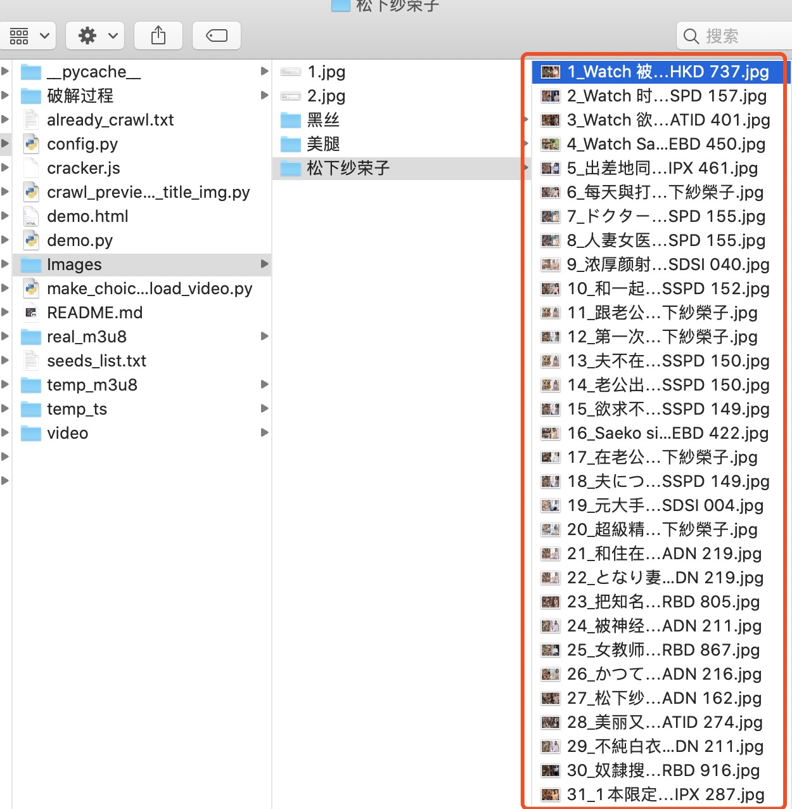
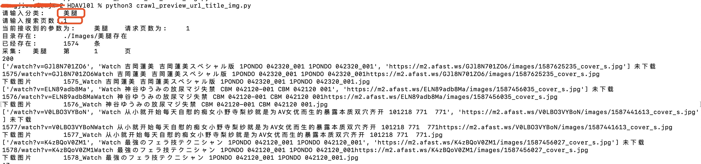
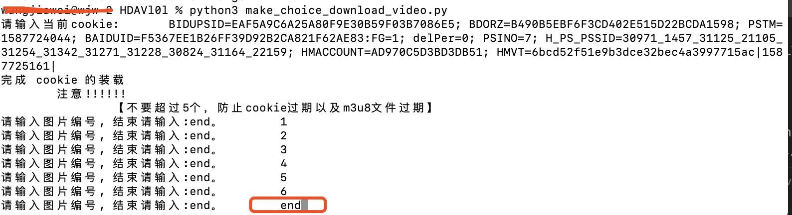

# [HDAVl0l](https://github.com/beforeuwait/HDAVl0l)  

> **申明**

**我目前自己的带宽是500M,下载视频时候15个进程同时跑，一个3G的视频几分钟可以下载完毕，刺激吧！ 比迅雷都快**

感谢 clone 这个项目

**因为这个网站视频质量比较高，基本1080p 无广告，下载速度快，非常良心**

这个视频下载是需要自己开会员的

我写这个项目，我是开了会员的

只是觉得下载视频还要额外给钱，挺恶心的，就自己写一个爬虫抓取视频

采集视频流思路大概也就这样

下载过程中使用多进程， 但是只支持同一时间下载一部

为了啥？ 毕竟充钱买了会员，也怕把人给爬急了

破解这个网站的加密，实时采集视频

>目前实现的功能:

- [x] 按照指定分类采集视频目录并保存图片
- [x] 下载视频
- [x] 下载视频去重
- [ ] 自动登录
- [x] 迭代种子下载器修改host为国内站

> **!!!请注意!!!***

        现在一定要看
        在下载种子的时候，我开发的时候开了蓝灯
        属于翻墙环境
        所以，在我没上传新一版的种子下载器的时候，不翻墙是不能用的
        只能根据
            seeds_list.txt 
        这个文件里的内容进行下载
        我看心情上传新版本

> 最新 2020-04-25

已经切换到国内的源了

不用翻墙了        

> 项目目录

    .
    ├── README.md                           \\  readme
    ├── seeds_list.txt                      \\  种子列表(映射)
    ├── already_crawl.txt                   \\  已采集
    ├── config.py                           \\  配置文件
    ├── cracker.js                          \\  逆向sdk
    ├── crawl_preview_url_title_img.py      \\  下载分类图片
    ├── demo.html                           \\  test
    ├── demo.py                             \\  test
    ├── make_choice_download_video.py       \\  下载视频
    ├── Images                              \\  图片目录
    │   ├── xx                              \\  分类  
    |   │   └──1_xxxxxxx.jpg                \\  图片ID+名称
    ├── real_m3u8                           \\  真实m3u8目录
    │   └── demo.m3u8                       \\  m3u8文件
    ├── temp_m3u8                           \\  临时m3u8目录
    │   └──demo.m3u8                        \\  临时m3u8文件
    ├── temp_ts                             \\  ts视频流目录
    │   └── demo.ts                         \\  ts文件
    ├── video                               \\  保存视频的目录
    │   └── demo.ts                         \\  一个完整的视频
    └── 破解过程                                \\ demo
        ├── xxxxxxx.html                    \\  demo
        └── xxxxxxx_files                   \\  demo
            └── xxxxx.js                    \\  demo

> 种子目录里长这样的

根据图片来选择自己是否下载

--
> **使用说明**

- 下载种子

        进入目录后启动:
        
            python3 crawl_preview_url_title_img.py
        会提示输入分类, 这时候按照自己的需求来 比如 美腿/黑丝/三上悠亚
        然后输入页数，需要采集几页，一般页面为60个视频
        回车，就开始下载了
        然后在 ./Images/目录下看具体的图片

- 下载视频

        进入目录后启动:
        
            python3 make_choice_download_video.py 
        然后会让你输入cookie
        这时候去页面找到自己的cookie
        怎么找我就不教了，等更新一版自动登录的
        然后
        就是输入视频编号
        就是图片的名称 比如 1_xxxxx.jpg
        就输入 1
        是 25_xxxxx.jpg
        就输入 25 
        输入结束的时候 输入 end 告诉程序结束
        不过自己去魔改也行

        然后就开始自动下载了
        视频流文件在 ./temp_ts/ 里
        下载完毕后，会合成完整的视频到 ./video/里
        同时删除原有的视频流文件
--
>2020-04-24 18:25

编辑 README.md

>2020-04-24 1:29

问题又被我解决了

是因为我挂了代理！！！！

翻墙出去，结果访问的是另一个

代码重新传

>2020-04-24 00:50

这网站牛逼啊

才下载4个视频

这网站就更新反爬虫策略了

不仅host 修改了

m3u8文件里视频地址请求参数也进行加密

这会儿太晚，明天来继续搞
